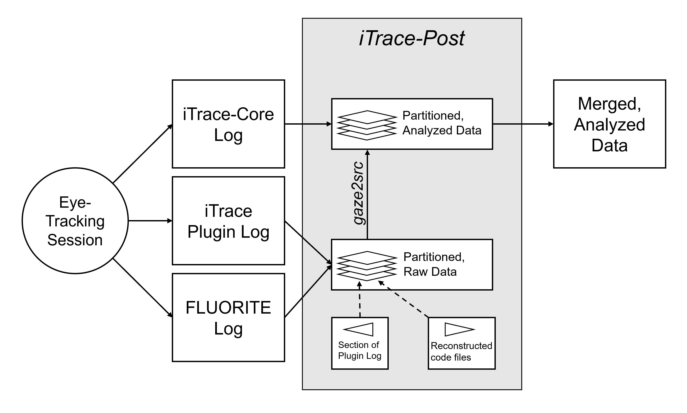

# iTrace-post
A pair of modules and sample script for processing output from the [iTrace plugin](www.i-trace.org),
particularly when used in tandem with the [FLUORITE plugin](http://www.cs.cmu.edu/~fluorite/).
The motivation for this repository is thus: In iTrace v0.0.1 (Alpha), editing is not supported. 
*If you used a later version of iTrace that explicitly supports editing, this issue does not apply 
to your experiment, and you do not need to run FLUORITE in addition to iTrace.* The work-around 
presented here is very time-consuming and should be avoided if at all possible.

As an additional useful tidbit, this code also performs automatic detection of Areas of Interest (AOIs) 
based on fixation data and code location.

## Quick Start
Run `setup.py` like this:
```$ python setup.py install```  
As soon as this completes, you're ready to import the `itrace_post` and `fluorite` 
modules into your project. Please note that you will need to copy the script 
`analyzer.py` if you wish to use it in your project. Alternatively, it may be helpful to use this 
script as an example when writing a similar script to read output from iTrace.
If you wish to do this, please refer to the [relevant notebook](examples/iTrace_post_processing.ipynb).

## Requirements
You must have the following programs installed and on your path:
* `gaze2src`
* `srcml`
* `tar`

The following modules are also required (among others):
* `numpy`
* `pandas`
* `scipy`

## Using `analyzer.py`
Please note that this script is written for experiments where there is a 
record from the [FLUORITE plugin](http://www.cs.cmu.edu/~fluorite/).
Given the parameters for the `gaze2src` program and a
list of directories containing raw data from iTrace and FLUORITE, this script 
separates your data such that each partition's data comes from a period during which the participant did not change the set 
of code documents. With the log from FLUORITE, the state of each project file during this period
is deduced. Once the data has been divided, the script runs `srcml` and `gaze2src` on each 
partition and then combines the data into a single file.

## Translation of iTrace Files
The `gaze2src` program is a part of the iTrace program suite that performs post-processing 
on raw iTrace data. The resulting data are stored in a tab-separated file and a 
SQL database file. The `post2csv` script in this project reads both these files and produces a 
CSV containing the line and column numbers of subjects' fixations, and assigns each fixation to 
a rectangular AOI.

## AOI Extraction And Assignment
Instead of pixels, the most basic spatial units are individual characters, corresponding to a particular source code file.
This perspective is feasible because iTrace records the line and column numbers associated with a
particular fixation. The position of a single character's cell is defined by zero-indexed line 
and column numbers. The `get_aoi_intersection` function produces a 2D numpy logical array describing 
the intersection between the subjects' gaze and the code in the file. (A single cell in this array 
represents a single character in the file). The rectangular bounding box of each region is considered
an AOI, and the bounding boxes are returned from this function as a JSON-style list, sorted by decreasing
area.

### Generating A Mask From Code
The size of a line of code is identified by its string length, after the removal of trailing newline 
characters and the conversion of all tab characters to 4 spaces. Other leading and trailing whitespace 
characters, such as spaces, are not removed from the code mask. This procedure is inspired by the 
[eyecode](https://github.com/synesthesiam/eyecode) project.

### Generating A Mask From Gaze Data
Gazes' durations are placed in a 2D numpy array, organized by gaze position. This array is smoothed
using Gaussian smoothing, and then a threshold is applied to reveal regions that attracted the 
majority of subjects' gazes. This procedure is inspired by the masking algorithm in the
[iMap](https://github.com/iBMLab/iMap4) project.

## General Architecture
The following diagram is a simplification, but it conveys the principle upon which this post-processor
operates.

In particular, the `gaze2src` program must take both the iTrace-Core log and the partitioned raw data
as inputs, as well as some additional parameters. Furthermore, during this process, analysis such as AOI generation 
is also performed, but this fact is not explicitly shown in the diagram.
